# go-Standard-library-tutorials
the go standard library(Function) tutorials for go SDK 1.18.

## Release
### go1.18 (released 2022-03-15)

[release notes](https://go.dev/doc/devel/release)

## Go Package Imports

```mermaid
graph TD
    archive/tar(archive/tar) --> bytes(bytes)
    archive/tar(archive/tar) --> bytes(bytes)
    archive/tar(archive/tar) --> errors(errors)
    archive/tar(archive/tar) --> fmt(fmt)
    archive/tar(archive/tar) --> internal/godebug(internal/godebug)
    archive/tar(archive/tar) --> io(io)
    archive/tar(archive/tar) --> io/fs(io/fs)
    archive/tar(archive/tar) --> math(math)
    archive/tar(archive/tar) --> os/user(os/user)
    archive/tar(archive/tar) --> path(path)
    archive/tar(archive/tar) --> path/filepath(path/filepath)
    archive/tar(archive/tar) --> reflect(reflect)
    archive/tar(archive/tar) --> runtime(runtime)
    archive/tar(archive/tar) --> sort(sort)
    archive/tar(archive/tar) --> strconv(strconv)
    archive/tar(archive/tar) --> strings(strings)
    archive/tar(archive/tar) --> sync(sync)
    archive/tar(archive/tar) --> syscall(syscall)
    archive/tar(archive/tar) --> time(time)

    archive/zip(archive/zip) --> bufio(bufio)
    archive/zip(archive/zip) --> compress/flate(compress/flate)
    archive/zip(archive/zip) --> encoding/binary(encoding/binary)
    archive/zip(archive/zip) --> errors(errors)
    archive/zip(archive/zip) --> hash(hash)
    archive/zip(archive/zip) --> hash/crc32(hash/crc32)
    archive/zip(archive/zip) --> internal/godebug(internal/godebug)
    archive/zip(archive/zip) --> io(io)
    archive/zip(archive/zip) --> io/fs(io/fs)
    archive/zip(archive/zip) --> os(os)
    archive/zip(archive/zip) --> path(path)
    archive/zip(archive/zip) --> path/filepath(path/filepath)
    archive/zip(archive/zip) --> sort(sort)
    archive/zip(archive/zip) --> strings(strings)
    archive/zip(archive/zip) --> sync(sync)
    archive/zip(archive/zip) --> time(time)
    archive/zip(archive/zip) --> unicode/utf8(unicode/utf8)

    bufio(bufio) --> bytes(bytes)
    bufio(bufio) --> errors(errors)
    bufio(bufio) --> io(io)
    bufio(bufio) --> strings(strings)
    bufio(bufio) --> unicode/utf8(unicode/utf8)
```

## 第一期完成度
### 5/18:
- [ ] archive
- [ ] bufio
- [ ] builtin
- [ ] bytes
- [ ] compress
- [ ] container
- [ ] context
- [ ] crypto
- [ ] database
- [ ] debug
- [ ] embed
- [ ] encoding
- [ ] errors
- [ ] expvar
- [ ] flag
- [x] fmt
- [ ] go
- [ ] hash
- [ ] html
- [ ] image
- [ ] index
- [x] io
- [ ] log
- [ ] math
- [ ] mime
- [ ] net
- [x] os
- [ ] path
- [ ] plugin
- [ ] reflect
- [ ] regexp
- [ ] runtime
- [ ] sort
- [ ] strconv
- [ ] strings
- [ ] sync
- [ ] syscall
- [x] testing
- [ ] text
- [x] time
- [ ] unicode
- [ ] unsafe
- [ ] internal

## 计划
总的来说，每周了解一个standard library,达到：WW等级。总结我自己用过的 function 对于第一眼看不到用处的先不管。 

* 2022.4.30 开始学习 fmt

## 疑问
* os func DirFS(dir string) fs.FS
* os func IsExist(err error) bool